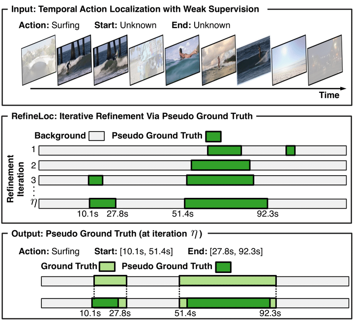

# RefineLoc: Iterative Refinement for Weakly-Supervised Action Localization
[[Paper]](https://arxiv.org/abs/1904.00227)
[[Project Website]](http://humamalwassel.com/publication/refineloc/)

This repository holds the official implementation of RefineLoc method presented in WACV 2021.

**RefineLoc: Iterative Refinement for Weakly-Supervised Action Localization.**
Alejandro Pardo*, Humam Alwassel*, Fabian Caba Heilbron, Ali Thabet, Bernard Ghanem. In *WACV*, 2021.



## Installation
Create the conda environment.
```
conda env create -f environment.yml
```
Download the features from the links provided in [data/README.md](./data/README.md) and place them in the correct subfolders inside the `data` folder.

## Training
Run the following command to reproduce the ActivityNet results presented in the paper:
```
sh src/slurm_scripts/slurm_run_best.sh
```

To reproduce the THUMOS14 results, change `CONFIG_TYPE` to `best_thumos14` in `src/slurm_scripts/slurm_run_best.sh`.

## RefineLoc + WTAL and RefineLoc + BasNet

*The two repos will be available soon.*


Please cite this work if you find the code useful for your research.
```
@InProceedings{pardo_2021_refineloc,
  title={RefineLoc: Iterative Refinement for Weakly-Supervised Action Localization},
  author={Pardo, Alejandro and Alwassel, Humam and Heilbron, Fabian Caba and 
          Thabet, Ali and Ghanem, Bernard},
  booktitle={Proceedings of the IEEE/CVF Winter Conference on Applications of 
             Computer Vision (WACV)},
  year={2021}
}
```
